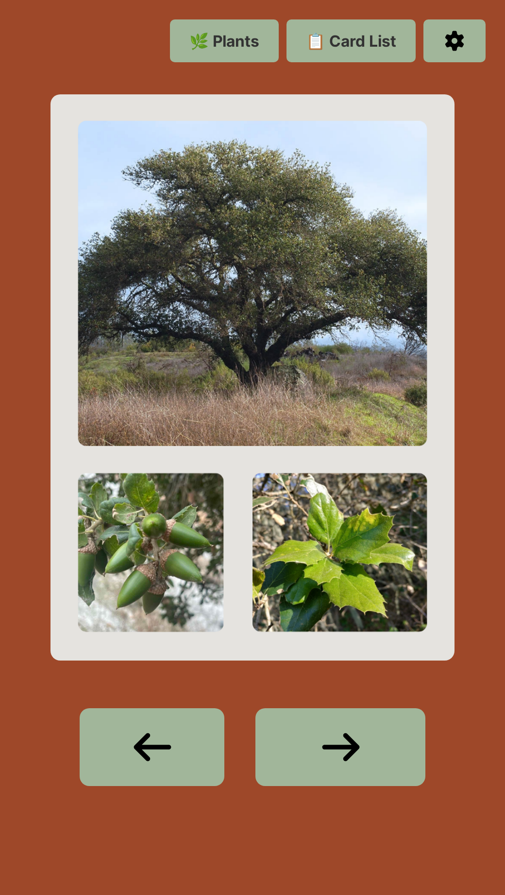
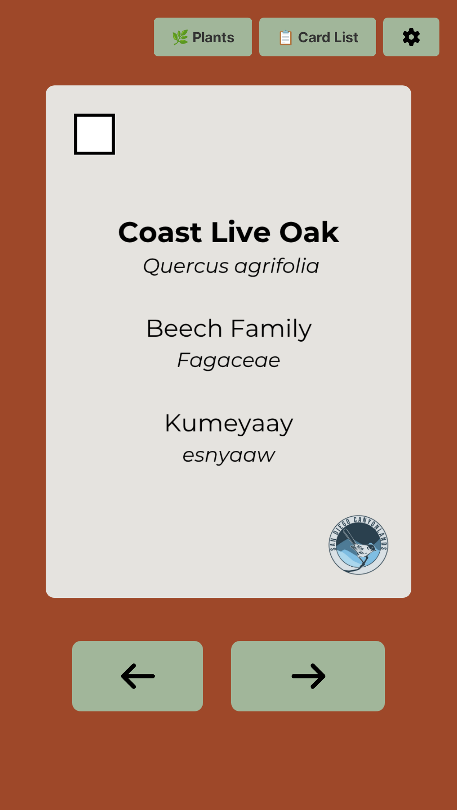
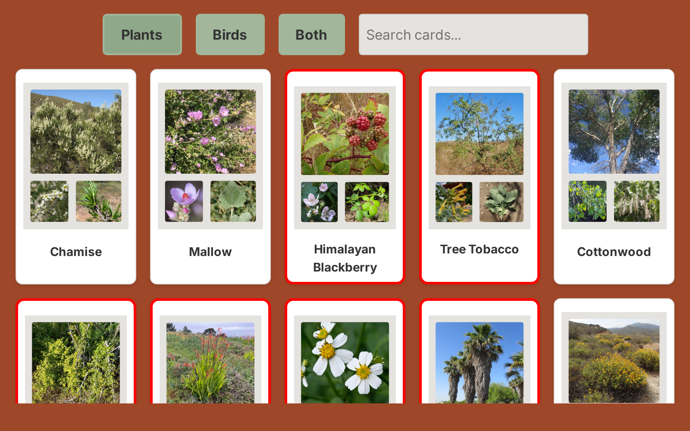
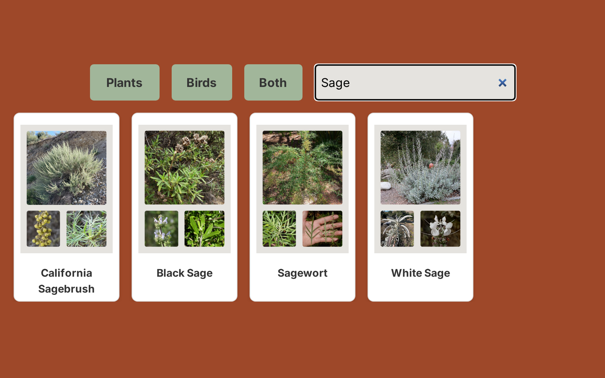
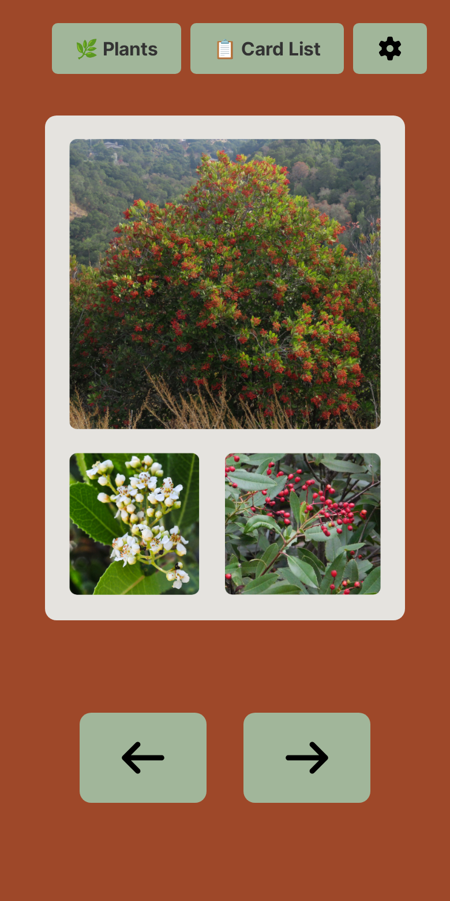
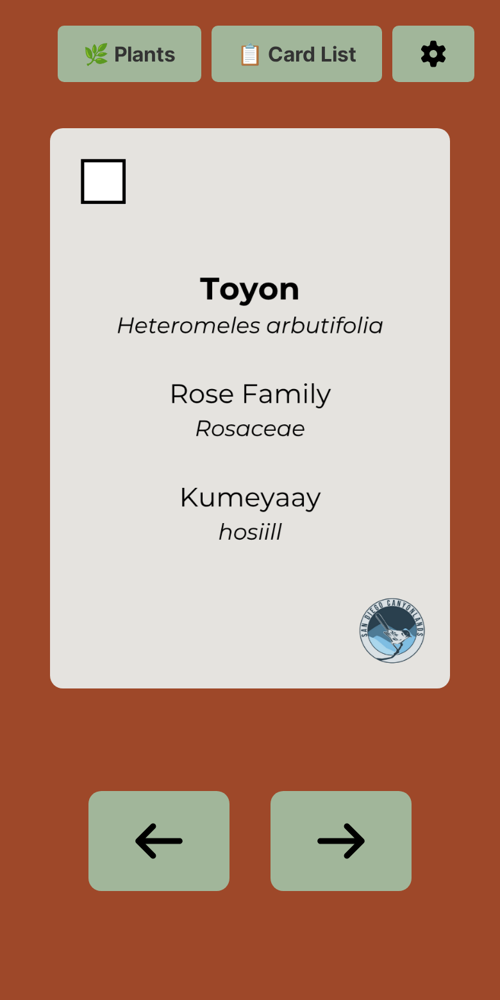

# San Diego Native Species Flashcards

<div align="center">

**An offline-first study app for identifying the birds and plants of the San Diego canyons**

A digital companion to San Diego Canyonlands' physical flashcard deck — 154 species (69 birds, 85 plants), each with field photos on the front and the common name, scientific name, family, and Kumeyaay name on the back.

## 🚀 [Open the app — cards.unimpossy.com](https://cards.unimpossy.com)


[](https://react.dev)
[](https://www.typescriptlang.org)
[](https://reactrouter.com)
[](https://tailwindcss.com)
[](#testing)
[](https://playwright.dev)
[](#deployment)

<p>
  
  
</p>

*Front of card (field photos) · Back of card (names and taxonomy)*

</div>

## What it does

Flip through the deck like real flashcards: photos on the front, names on the back. The app is offline-first: all 154 cards and their images can be cached on the device with one tap, after which the app runs entirely without a network as a PWA.

For a general audience:

- **Study by category** — Plants, Birds, or both, with a shuffled deck so no two sessions feel the same.
- **Browse and search** — A searchable card catalog for quickly looking up any species.
- **Learn to spot invaders** — 35 invasive plant species are marked with a red border to build conservation awareness.
- **Works offline** — Installable as a PWA; study without a network after a one-time download.
- **Works like a real deck** — 3D card flip with adjustable speed, keyboard controls, hover-to-peek on desktop, and tap-to-flip on touch screens.

## Engineering highlights

| Area | What's inside |
|---|---|
| **Offline-first architecture** | Two-tier service worker: versioned cache-first strategy for card images (with graceful fallback to the previous cache generation) and network-first for the app shell. A user-triggered preload fetches ~300 progressive-JPEG card images with a live progress bar, and a post-build script injects hashed asset names into the service worker so every deploy caches correctly. |
| **Privacy by design** | Cookieless analytics (Umami Cloud) and crash reporting are enabled by default and can be switched off at any time from Settings or the first-visit banner; every tracking call re-checks the current preference, so tracking pauses immediately. There are no cookies, no persistent identifiers, and fonts are self-hosted, so nothing leaves the device to third parties except the two optional telemetry endpoints. A [privacy policy](https://cards.unimpossy.com/privacy) page documents exactly what is collected, and Playwright tests assert payloads carry no identifiers and that opting out stops all network calls. |
| **Testing culture** | 258 tests: 217 unit/integration tests (Vitest) and 41 end-to-end tests (Playwright) across Chromium, Firefox, WebKit, Mobile Chrome, and Mobile Safari — roughly 1.8 lines of test code for every line of application code. Includes fast-check property-based tests for deck/shuffle invariants, a custom flakiness harness that runs the suite 10× to catch instability, and CSS parser tests that lock touch/hover behavior in as executable contracts. |
| **Production operations** | Multi-stage Docker build on Alpine with the git SHA injected at build time and surfaced in the UI for provenance. Kubernetes manifests with hardened pods (non-root, read-only root filesystem, all capabilities dropped, resource limits, health probes) behind Traefik with automatic Let's Encrypt TLS. A dedicated Express crash-report microservice, covered by its own supertest suite. |

## Screenshots

| | |
|---|---|
|  |  |
| *Browsable catalog with live search and category filters* | *Search narrows 154 species instantly* |
|  |  |
| *Mobile: card front* | *Mobile: flipped card* |

## Features

- **Three study modes** — Plants, Birds, or Both; the deck is built from 10 shuffled repetitions of the species list per session (Fisher–Yates shuffle).
- **Card list page** — Filterable, searchable catalog with thumbnails; invasive species highlighted; click through to deep-link straight to a card.
- **Adjustable flip speed** — 3D CSS `rotateY` flip animated via a `--flip-speed` CSS variable, configurable from 2 seconds to instant, persisted per user.
- **Keyboard shortcuts** — `Space` flips, `←`/`→` navigate, holding `↑` peeks at the back, `Esc` closes menus.
- **Pointer-aware interactions** — Hover-to-peek is enabled only on devices reporting fine pointers; tap-to-flip is touch-tested with dedicated `hasTouch` Playwright suites.
- **Offline support** — One-tap image preload with progress bar; service worker keeps the app fully usable offline; an e2e test loads the app with the network cut off.
- **Installable PWA** — Web app manifest, standalone display, theme color, and Apple meta tags for home-screen install.
- **Consent-friendly telemetry** — Cookieless analytics (Umami, auto-track disabled) and crash reporting are on by default, documented in the [privacy policy](https://cards.unimpossy.com/privacy), and can be disabled anytime via Settings or the first-visit banner; error reports are POSTed to a separate microservice only while crash reporting is enabled.

## Testing

```bash
npm run test          # Vitest in watch mode
npm run test:run      # Vitest headless
npm run test:coverage # Coverage report
npx playwright test   # End-to-end tests
```

- **Unit/integration (Vitest):** 217 tests across 16 files — deck construction invariants, shuffle correctness, consent and tracking logic, error reporting lifecycle, service worker registration, settings/menu components, and Express API tests via supertest.
- **Property-based (fast-check):** Deck invariants (every card appears exactly 10×, only valid species, correct lengths) and shuffle permutation properties verified against arbitrary generated inputs.
- **End-to-end (Playwright):** 41 tests in 5 suites run across 5 browser projects — consent banner and opt-out behavior with network interception, privacy policy page integrity, keyboard/click/touch flip behavior (asserted on computed transforms), responsive layout at 375/768/1920 px, offline mode, corrupted localStorage recovery, and image 404 handling.
- **Stability:** A custom harness (`scripts/run_tests.ts`) reruns the unit suite up to 10× and reports failure counts to catch flaky tests before they land.
- **CSS as contract:** A hand-written CSS parser test asserts flip semantics (e.g., hover never transforms the card, rotation only under `.flipped`, `touch-action: manipulation` on the card area) — preventing whole classes of touch regressions.

## Tech stack

| Layer | Tools |
|---|---|
| Frontend | React 19, React Router 7 (framework mode, SPA), TypeScript 5.9, Tailwind CSS 4, Vite 7 |
| PWA / offline | Service worker (cache-first images, network-first shell), Web App Manifest, image preloading |
| Testing | Vitest 4, React Testing Library, fast-check, Playwright, supertest |
| Backend (errors) | Node.js + Express microservice |
| Infrastructure | Docker (multi-stage), Kubernetes (hardened deployments), Traefik, cert-manager (Let's Encrypt) |

## Getting started

Requires Node.js 20+.

```bash
git clone <repository-url>
cd cards
npm install
npm run dev        # http://localhost:5173
```

Other useful commands:

```bash
npm run build      # Production build
npm start          # Serve the production build locally
npm run typecheck  # Generate routes + run tsc
```

## Deployment

The app ships as a static SPA built inside a multi-stage Docker image:

```bash
docker build -t cards --build-arg BUILD_SHA=$(git rev-parse --short HEAD) .
docker run -p 3000:3000 cards
```

Kubernetes manifests in `k8s/` deploy two services:

- **Cards** — the PWA itself, in production at [`cards.unimpossy.com`](https://cards.unimpossy.com) (testing environment at `testing.cards.unimpossy.com`), with resource limits, non-root/read-only containers, dropped capabilities, and liveness/readiness probes.
- **Error receiver** (`error-receiver/`) — a minimal Express service at `errors.cards.unimpossy.com` that accepts crash reports (sent only while crash reporting is enabled) and logs them as structured JSON for collection.

Ingresses use Traefik with cert-manager-issued Let's Encrypt certificates; deploy scripts build images with the current git SHA and push to a private registry.

## Project structure

```
app/
  routes/          # Home (card flipper), card-lists (catalog), and privacy policy routes
  card/            # 3D flip card component
  components/      # Settings, consent banner, menus, progress bar
  utils/           # Deck building, shuffling, error reporting
public/
  cards/           # 330 progressive JPEG card images (front/back pairs)
  fonts/           # Self-hosted Inter variable fonts
  service-worker.js
scripts/           # Image pipeline, manifest updater, flakiness harness
k8s/               # Deployment, service, and ingress manifests
error-receiver/    # Express crash-report microservice
test/              # Vitest unit tests + Playwright e2e suites
```

## Credits

Card imagery courtesy of [San Diego Canyonlands](https://www.sdcanyonlands.org/), whose physical native-species flashcard deck this app digitizes.
